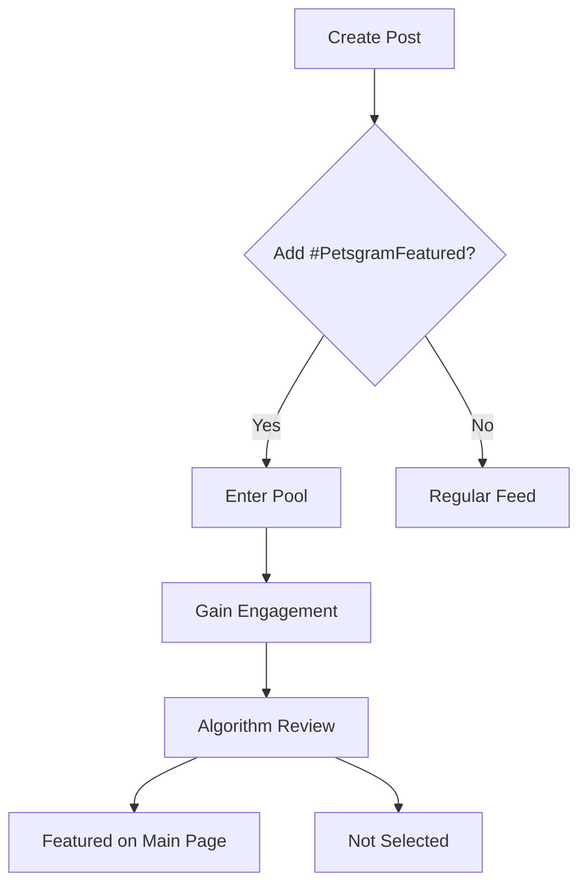

## Overview

Petsgram lets you showcase your pets to a vibrant community of fellow owners. Share photos and videos of your furry friends, use special hashtags to get featured on the main page, browse endless pet content, and connect through likes, comments, and direct messages. Whether you have a playful puppy or a majestic cat, these core features make it easy to build your pet's online presence and find inspiration from others.

## Key Features

Discover the essential tools that power your Petsgram experience.

<Columns cols={2}>
  <Card title="Post Sharing" icon="image" href="#create-post">
    Upload high-quality photos and videos with captions and hashtags. Reach thousands of pet lovers instantly.
  </Card>
  <Card title="Hashtag Spotlight" icon="hash" href="#hashtag-system">
    Use `#PetsgramFeatured` to compete for main page visibility. Your post could be the next star.
  </Card>
  <Card title="Content Discovery" icon="search" href="#browsing">
    Scroll through trending feeds, explore by breed or hashtag, and save favorites effortlessly.
  </Card>
  <Card title="Community Engagement" icon="users" href="#community-tools">
    Like, comment, follow, and message to build lasting connections with other pet enthusiasts.
  </Card>
</Columns>

## Create and Share Posts

Start building your pet's fame with simple, intuitive posting. Follow these steps to create engaging content.

<Steps>
  <Step title="Select Media" icon="image">
    Choose photos or videos from your gallery. Supports up to 10 items per post for carousels.
  </Step>
  <Step title="Add Caption and Hashtags" icon="edit-3">
    Write a fun caption and include relevant hashtags like `#GoldenRetriever` or `#PetsgramFeatured`.
  </Step>
  <Step title="Tag Location and Pets" icon="map-pin">
    Add your location and tag breeds for better discoverability.
  </Step>
  <Step title="Publish" icon="send">
    Hit publish to share instantly. Your post appears in followers' feeds and search results.
  </Step>
</Steps>

<Callout kind="tip">
  Include at least 3-5 hashtags per post to maximize reach. Track performance in your profile analytics.
</Callout>

## Hashtag System for Main Page Features

The hashtag system curates the best user content for the homepage. Posts with `#PetsgramFeatured` enter a daily rotation based on likes, comments, and relevance.



This flow ensures high-quality, engaging posts rise to the top. Aim for authentic content to boost your chances.

## Browsing and Interacting with Content

Navigate Petsgram's feeds seamlessly across platforms.

<Tabs>
  <Tab title="Web Browser" icon="globe">
    Use the full desktop site at [petsgram.net](https://petsgram.net) for expansive views.

    - Infinite scroll through personalized feeds
    - Advanced filters by breed, location, or hashtag
    - Quick like/comment with keyboard shortcuts

    ```javascript
    // Example: Embed Petsgram feed on your site
    const feed = document.querySelector('#petsgram-feed');
    feed.innerHTML = '<iframe src="https://petsgram.net/embed/feed?hashtag=PetsgramFeatured" width="100%" height="600"></iframe>';
    ```
  </Tab>
  <Tab title="Mobile App" icon="smartphone">
    Download the iOS/Android app for on-the-go access.

    - Push notifications for new likes and follows
    - Swipe to like, double-tap to heart
    - AR filters for previewing posts

    <Callout kind="info">
      App-exclusive stories feature lasts 24 hours.
    </Callout>
  </Tab>
</Tabs>

## Community Connection Tools

Forge real bonds beyond likes and shares.

| Tool | Description | How to Use |
|------|-------------|------------|
| Follow | See posts from favorite accounts in your feed | Click follow button on profiles |
| Comments | Start conversations under posts | Tap comment icon and type |
| Direct Messages | Private chats with one-tap sharing | Search users and send pet pics |
| Groups | Join breed-specific communities | Browse groups in explore tab |

<Expandable title="Advanced Networking Tips" default-open="false">
  Host live sessions or challenges using group tools. Collaborate on pet care tips to grow your network organically.
</Expandable>

<CodeGroup tabs="JavaScript,Python">
  ```javascript
  // Share post via API (requires auth)
  fetch('https://api.petsgram.net/v1/posts', {
    method: 'POST',
    headers: { 'Authorization': 'Bearer YOUR_TOKEN' },
    body: JSON.stringify({
      media: ['photo.jpg'],
      caption: 'My dog at the park! #PetsgramFeatured',
      hashtags: ['dogsofinstagram']
    })
  });
  ```
  ```python
  # Share post via API
  import requests
  response = requests.post(
      'https://api.petsgram.net/v1/posts',
      headers={'Authorization': 'Bearer YOUR_TOKEN'},
      json={
          'media': ['photo.jpg'],
          'caption': 'My dog at the park! #PetsgramFeatured',
          'hashtags': ['dogsofinstagram']
      }
  )
  ```
</CodeGroup>