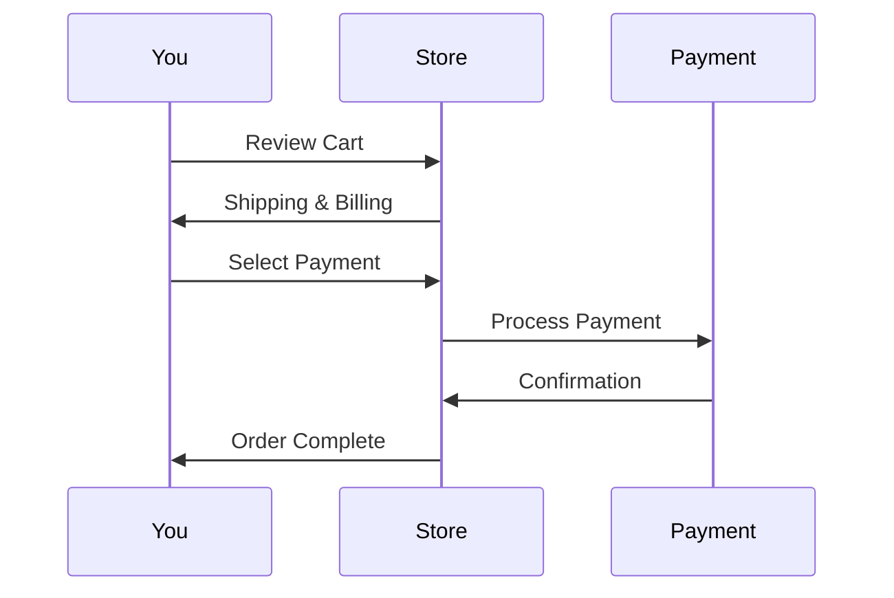

## Overview

Access the Petsgram Store from your account dashboard at `https://petsgram.net/store`. Browse thousands of pet products including toys, food, accessories, and grooming supplies. Use powerful search and filter tools to find exactly what your pet needs. Add items to your cart, review your selections, and complete secure checkout with multiple payment options.

<Callout kind="info">
  New users receive a `{10% OFF}` welcome discount on their first purchase. Apply code `WELCOME10` at checkout.
</Callout>

## Product Categories

Discover products organized by category for quick browsing.

<Columns cols={3}>
  <Card title="Pet Toys" icon="activity" href="#search-products">
    Interactive toys, chewables, and fetch games for endless fun.
  </Card>
  <Card title="Food & Treats" icon="apple" href="#search-products">
    Premium kibble, wet food, and healthy treats tailored to your pet's needs.
  </Card>
  <Card title="Accessories" icon="shopping-bag" href="#search-products">
    Collars, leashes, beds, and carriers for comfort and style.
  </Card>
</Columns>

## Searching and Filtering Products

Narrow down options efficiently.

<Steps>
  <Step title="Enter Search Terms" icon="search">
    Type keywords like `dog toy` or `cat litter` in the search bar at the top of the store page.
  </Step>
  <Step title="Apply Filters" icon="sliders">
    Use sidebar filters for price (`<{$20}`), brand, pet type (`Dog`, `Cat`, `Other`), ratings (`>4 stars`), and availability.
  </Step>
  <Step title="Sort Results" icon="list">
    Sort by `Best Sellers`, `Price Low to High`, `Newest`, or `Customer Reviews`.
  </Step>
</Steps>

## Adding Items to Cart

Build your cart step by step.

<Steps>
  <Step title="Select Product" icon="mouse-pointer">
    Click any product image or title to view details, reviews, and sizing info.
  </Step>
  <Step title="Choose Options" icon="settings">
    Select quantity, size, color, or flavor variants.
  </Step>
  <Step title="Add to Cart" icon="shopping-cart">
    Click `Add to Cart`. Review in the cart icon (top right) showing item count.
  </Step>
</Steps>

## Completing Checkout Securely

Proceed to checkout from your cart summary.



<Tabs>
  <Tab title="Credit Card" icon="credit-card">
    Enter card details securely via Stripe integration. Supports Visa, Mastercard, Amex.
    
    <Callout kind="tip">
      Save card for faster future checkouts. All transactions use HTTPS and PCI compliance.
    </Callout>
  </Tab>
  <Tab title="PayPal" icon="paypal">
    Click `Pay with PayPal` and log in to your account. No card details needed.
  </Tab>
</Tabs>

## Managing Order History

Track your purchases anytime.

<Expandable title="View and Manage Orders" default-open="true">
  Navigate to `Account > Orders` in your dashboard.
  
  - **Track Shipment**: Click `Track` for real-time updates via carrier API.
  - **Reorder**: Select `Reorder` to add identical items to a new cart.
  - **Returns**: Eligible items within `{30 days}`. Initiate from order details.
  - **Refunds**: Processed to original payment method in `{3-5 business days}`.
  
  | Status     | Meaning                     | Action                  |
  |------------|-----------------------------|-------------------------|
  | Pending    | Payment processing         | Wait or contact support |
  | Shipped    | On the way                 | Track shipment         |
  | Delivered  | Arrived                    | Rate & review          |
  | Returned   | Returned for refund        | Check refund status    |

  For developers, fetch orders via API:

  <CodeGroup tabs="JavaScript,cURL">
  ```javascript
  const response = await fetch('https://api.example.com/v1/orders', {
    headers: { Authorization: `Bearer ${YOUR_TOKEN}` }
  });
  const orders = await response.json();
  ```
  ```bash
  curl -H "Authorization: Bearer YOUR_TOKEN" https://api.example.com/v1/orders
  ```
  </CodeGroup>
</Expandable>

<Callout kind="success">
  Questions? Contact support at `support@petsgram.net` or use live chat.
</Callout>